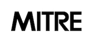

Software Tools
===

*fusera*
---

*fusera* (FUSE for SRA) is a [FUSE](https://en.wikipedia.org/wiki/Filesystem_in_Userspace) implementation for the cloud extension to the [NCBI Sequence Read Archive (SRA)](https://www.ncbi.nlm.nih.gov/sra). SRA accepts data from all kinds of sequencing projects including  studies that involve human subjects or their metagenomes, which may contain human sequences. Access to this data is controlled via [dbGaP (the database of Genotypes and Phenotypes)](https://www.ncbi.nlm.nih.gov/gap/).  To gain access to data from such a controlled access study, users would submit a Data Access Request (DAR) for their research project.  Users with approved DARs can access the study's phenotype and genotype data via dbGaP, and the sequence data via the SRA.  Traditionally, the SRA was a repository that facilitated download of data to the user's compute environment.  As part of the Sequence Data Delivery Pilot (SDDP), the SRA has been extended to provide access to cloud-hosted data through its [Data Locator web-services API](https://www.ncbi.nlm.nih.gov/Traces/sdl/1/)  using signedURL.  *fusera* presents selected SRA data referenced with an SRA accession number to authorized users as a read-only file system, enabling users and tools to access the data through a file system interface.  

*fusera* presents all of the cloud-hosted SRA data for a set of SRA Accession numbers as a mounted directory, with one subdirectory per SRA Accession number. The user’s credentials are passed through a [dbGaP repository key](https://www.ncbi.nlm.nih.gov/books/NBK63512/), or ngc file, that is obtained from dbGaP.  *fusera* automatically detects the cloud region where it is deployed on both AWS and GCP, and requests access to data from the SRA's Data Locator web-servvices API within that same region with the aim of limiting charges for data egress. *fusera* is intended for deployment on AWS or GCP.

*sracp*
---

Users may want to copy data from its cloud bucket into the local storage of their cloud-hosted virtual machine, instead of operating on the data in-place using *fusera*.  *sracp* addresses this need.   Given a list of SRA accession numbers, a dbGaP repository key, and a target directory, *sracp* copies the data from its cloud bucket into a specified target directory on a cloud-based virtual machine.  The user’s credentials are passed through a [dbGaP repository key](https://www.ncbi.nlm.nih.gov/books/NBK63512/), or ngc file, that is obtained from dbGaP.  *sracp* automatically detects the cloud region where it is deployed on both AWS and GCP, and requests access to data from the SRA's Data Locator web-servvices API within that same region with the aim of limiting charges for data egress. *sracp* is intended for deployment on AWS or GCP.

Installation
===

See installation instructions on the [wiki](https://github.com/mitre/fusera/wiki/Installing-Fusera).

Dependencies
===

*fusera*
---

Depending on the linux distro, `fuse-utils` may need to be installed.

Mac users must install `osxfuse` either on their [website](https://osxfuse.github.io) or through [Homebrew](http://brew.sh/):

```ShellSession
brew cask install osxfuse
```

Usage
===

In an effort to keep the instructions as up to date as possible, please refer to the [wiki](https://github.com/mitre/fusera/wiki/) for instructions on how to use *fusera* and *sracp*.

Troubleshooting
===

See [troubleshooting](https://github.com/mitre/fusera/wiki/Troubleshooting) page on the wiki.

License
===

*fusera* started its life as a hard fork of the [Goofys](https://github.com/kahing/goofys) project.

Copyright (C) 2015 - 2017 Ka-Hing Cheung

Modifications Copyright (C) 2018  The MITRE Corporation

> The modifications were developed for the NIH Data Commons Pilot. General questions can be forwarded to:
>
> opensource@mitre.org  
> Technology Transfer Office  
> The MITRE Corporation  
> 7515 Colshire Drive  
> McLean, VA 22102-7539  

Licensed under the Apache License, Version 2.0

Only the functionality needed was retained from the Goofys project. These files were removed from the original source:

- api/api.go
- internal/
  - perms.go
  - ticket.go
  - ticket_test.go
  - v2signer.go
  - minio_test.go
  - goofys_test.go
  - aws_test.go

There has also been some refactoring of the codebase, so while some files have been removed, the code in them might exist in other files. License headers and copyright have been kept in these circumstances.

The major changes to the original source stem from *fusera*'s use case.  Goofys was designed to present the content of a single bucket as a file system.  *fusera* is designed to present the data associated with a collection of SRA accessions as a file system, and the data can be spread across many buckets.

Goofys' start up was modified to determine the content of the presented file system based on querying the NCBI Data Locator API, rather than querying the content of the target bucket.

References
===

*fusera* owes much to the [Goofys](https://github.com/kahing/goofys) project: a high-performance, POSIX-ish file system written in Go which was used as a starting point.
